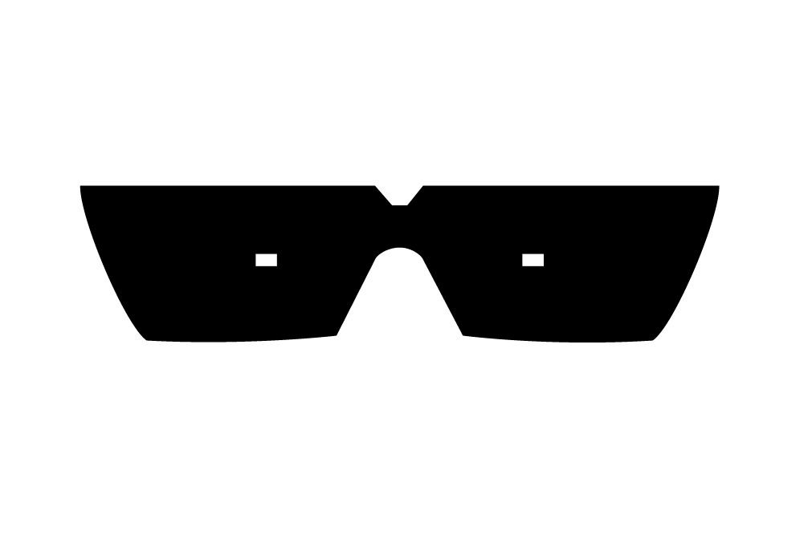
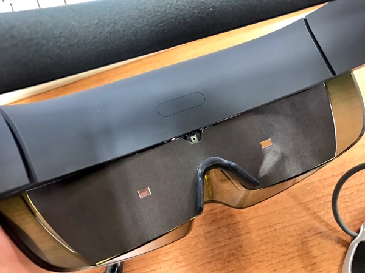

# hololens-physical-fill-black-outside
A vector template (.ai) of physical black shade for MS HoloLens. It covers outside of FOV.

Note that this design is just a template. The proper size and position of the holes depends on person and your HoloLens device.

# How to Install
Print the hololens_physical_black_fill.ai or .pdf to A4 paper. Then cut out the black part and attach it as following.

